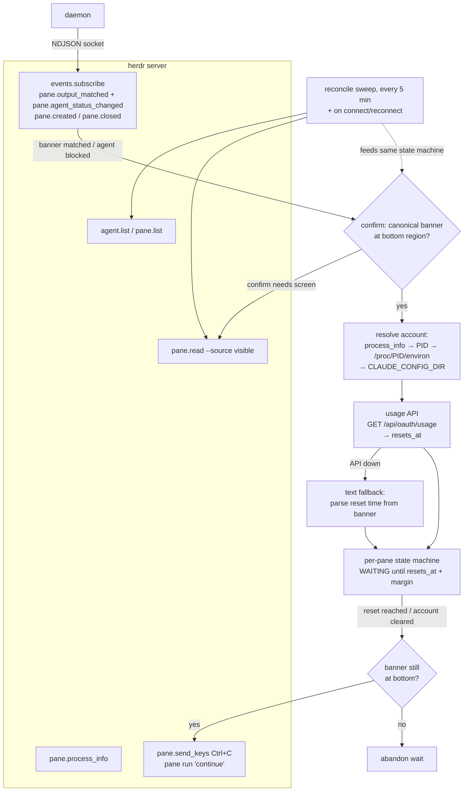
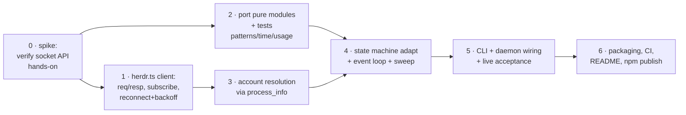
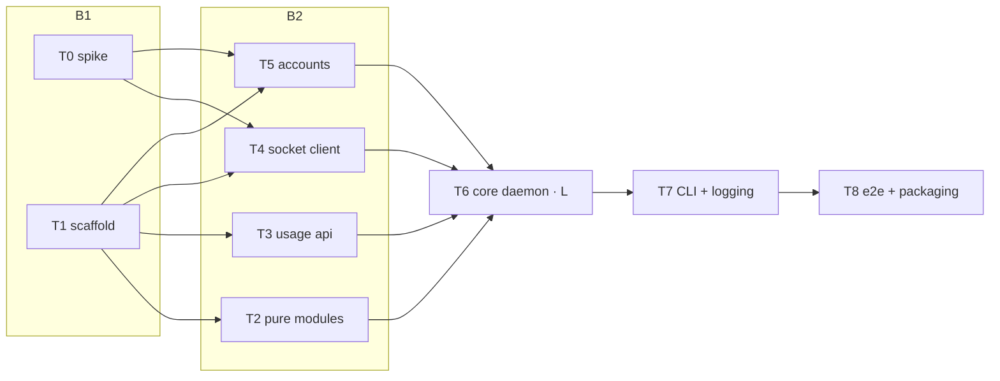

# herdr-claude-retry — SPEC

Port of [`claude-retry`](https://github.com/tigorlazuardi/claude-retry) (zellij screen-dump rate-limit watcher) to [herdr](https://herdr.dev/): an event-driven daemon that detects when a Claude Code pane hits Anthropic's usage limit, waits until the limit resets, and injects `continue` to resume the task automatically.

**FASE 1 spec — mode-neutral.** Any executor (one-shot / ralph / fleet / workflow) ingests this unmodified.

## Goal & done-condition

A standalone TypeScript daemon (`herdr-claude-retry start`) that:

1. Connects to the herdr socket API and subscribes to pane events.
2. Detects a rate-limited Claude Code pane the moment the banner appears (event push, not polling).
3. Resolves the exact reset time via the OAuth usage API (multi-account aware), with on-screen text parsing as fallback.
4. Waits until reset, then injects `continue` into that pane.
5. Also auto-recovers panes parked at transient `API Error:` banners (bounded retries).

**Verifiable done:**

- `npm run verify` (typecheck + `node --test` + build) passes; state-machine, patterns, time-parser, usage, and account modules have unit tests at parity with `claude-retry` (~8 test files there).
- Live acceptance: with the daemon running against a real herdr session, a pane showing the canonical limit banner is detected, a wait is scheduled at `resets_at` (visible in logs), and `continue` is injected after reset. A pre-existing blocked pane (blocked *before* daemon start) is also picked up by the reconcile sweep.
- Package publishes to npm as `@tigorhutasuhut/herdr-claude-retry` via GitHub Actions trusted publishing.

## Scope

| In scope | Out of scope (non-goals) |
|---|---|
| herdr socket API client (NDJSON over local socket) | zellij support (stays in `claude-retry`) |
| Event-driven detection + hybrid reconcile sweep | Any change to the `claude-retry` repo |
| Usage API tier-1 reset resolution (`/api/oauth/usage`) | Claude Code hooks / transcript-JSONL watching (documented alternative, not built) |
| Text-parse fallback when usage API down | Windows support (herdr Windows is beta; `/proc` bridge is Linux-only anyway) |
| Multi-account resolution (Linux `/proc` bridge) | GUI / TUI of any kind |
| `API Error:` auto-retry (backoff 10s, max 5) | OTel export (see Telemetry decision) |
| npm publish + trusted publishing CI | herdr plugin packaging (daemon only) |

## Architecture

### Detection tiers (unchanged philosophy from claude-retry)

1. **Trigger** (new: push, not poll) — `pane.output_matched` with registered limit-banner regexes, and `pane.agent_status_changed` → `blocked`. Text is only ever a *trigger*.
2. **Truth** — usage API `resets_at` per account (`utilization >= threshold`, default 90, env `CLAUDE_RETRY_LIMIT_THRESHOLD`). Called only when at least one pane is triggered/waiting — zero API calls when idle.
3. **Fallback** — `time-parser` on the banner's reset line when the API is unreachable. A bare past time means already reset — never rolled to tomorrow.
4. **Anti-false-positive gate** — inject only when the *canonical* banner (strict patterns) sits in the bottom ~15 non-empty lines (`isBlockedAtBanner`), i.e. Claude is parked at the limit above its input box, not merely scrollback text.

### Module map (reuse from claude-retry)

| Module | Origin | Change |
|---|---|---|
| `patterns.ts` | copy | none (pure) |
| `time-parser.ts` | copy | none (pure) |
| `usage.ts` | copy | none (pure, DI'd fetch) |
| `monitor.ts` state machine | copy | deps interface only: capture/inject/list re-addressed to herdr pane ids; polling loop replaced by event loop + sweep |
| `accounts.ts` | adapt | pane→account resolution simplified: herdr `pane.process_info` gives the pane's PID directly — replaces the zellij pts-set heuristic (see Decision) |
| `zellij.ts` | replace | new `herdr.ts`: socket client (connect, request/response by `id`, subscription stream, reconnect w/ backoff) |
| `cli.ts` | rewrite | `start` (daemon) only; no single-pane legacy mode |

## Decisions

<Decision title="Standalone herdr-only TypeScript project" status="accepted">
New repo (`herdr-claude-retry`), not a multi-backend refactor of `claude-retry`. TypeScript keeps ~700 LOC of tested pure modules (patterns, time-parser, usage, accounts) copy-able. The zellij version lives on unchanged. User-confirmed.
</Decision>

<Decision title="Standalone daemon over herdr plugin" status="accepted">
CLI daemon connecting to the herdr socket — runs anywhere (herdr pane, nohup, systemd later). herdr's plugin API is unverified; the socket API is documented and sufficient. User-confirmed.
</Decision>

<Decision title="Hybrid detection: event subscription + 5-minute reconcile sweep" status="accepted">
`events.subscribe` is primary (idle = zero work). A slow sweep (`agent.list`/`pane.list` + `pane.read` where needed) catches: panes blocked before daemon start, missed events, and state after daemon/herdr restarts. Sweep also runs immediately on every (re)connect. User-confirmed.
</Decision>

<Decision title="Usage API stays tier-1 truth; screen text is trigger-only" status="accepted">
`GET https://api.anthropic.com/api/oauth/usage` (OAuth token from `<CLAUDE_CONFIG_DIR>/.credentials.json`) is the authoritative source of `resets_at` and limited/cleared state. It is undocumented but proven in claude-retry. Regex on pane text only ever *triggers* a check — never schedules an inject on its own while the API is reachable. Claude Code offers no built-in auto-resume and hooks carry no reset timestamp, so this remains the best available source.
</Decision>

<Decision title="Account resolution via pane.process_info instead of pts heuristic" status="proposed">
claude-retry maps pane→account by intersecting zellij server fds with claude process pts — fragile. herdr's `pane.process_info` returns the pane's shell PID and foreground process group directly: walk children (or match foreground pgid) to the `claude` process, read `/proc/<pid>/environ` for `CLAUDE_CONFIG_DIR`. Simpler and per-pane exact. Fallbacks keep the old three-tier order: sole account → sole limited account → process bridge → unknown.
</Decision>

<Decision title="Telemetry: structured JSON logs only (no OTel export)" status="accepted">
Conscious override of the OTel-by-default rule: personal homeserver tool, logs-first. JSON lines to stderr; no OTLP, no metrics backend. Revisit only if the daemon grows a fleet of consumers. User-confirmed.
</Decision>

<Decision title="Inject sequence: Ctrl+C then submit 'continue'" status="accepted">
Same as claude-retry: one Ctrl+C clears half-typed input without quitting Claude Code, then `continue` + Enter. Via herdr: `pane.send_keys` (Ctrl+C) then `pane run <id> "continue"` (text + Enter atomically).
</Decision>

<Callout type="warn" title="Spike required: herdr socket API details are unverified">
The socket API surface (methods `pane.read`, `pane.send_keys`, `events.subscribe` with `pane.output_matched`, `pane.process_info`, `agent.list`) was verified from herdr.dev docs at summary level only. Exact request/response payloads, the socket path, whether `output_matched` accepts caller-registered regexes (and their syntax), and how to identify the daemon's own pane (to never watch itself) MUST be verified hands-on against the installed herdr before the client is built. This is the first task of any execution plan; findings feed the client design.
</Callout>

<Callout type="danger" title="Risk surface">
- **Secrets read:** OAuth access token from `.credentials.json` — held in memory only, sent only to `api.anthropic.com`, never logged (Tier A).
- **Writes into live sessions:** the daemon injects keystrokes into user panes. Mitigations (all ported from claude-retry): canonical-banner-at-bottom gate before every inject, wait abandoned when banner disappears, API-error retries capped at 5.
- **Upstream fragility:** banner wording (regexes), the undocumented usage API, and herdr's socket API can all change. Regexes and API parsing are isolated in single modules with tests; failure degrades to "no action", never to spurious injects.
- No auth/DB/migration/money surface. Public artifact = npm package (same publishing posture as claude-retry).
</Callout>

## Telemetry (logs-only contract)

Structured JSON lines to stderr, one event per line: `{ts, level, event, pane?, account_dir?, ...fields}`.

| Event | Level | Notes |
|---|---|---|
| `daemon.start` / `daemon.stop` | info | version, socket path |
| `socket.connected` / `socket.disconnected` / `socket.reconnecting` | info / warn | backoff attempt count |
| `pane.discovered` / `pane.dropped` | info | miss-counter drop reason |
| `limit.detected` | info | trigger source (`event`/`sweep`), matched pattern name, reset line text |
| `limit.confirmed` | info | source: `usage-api` / `text-fallback`, `resets_at` |
| `wait.scheduled` / `wait.abandoned` | info | `resets_at`+margin / reason (banner gone, no canonical banner) |
| `inject.sent` | info | kind: `continue` / `api-retry` (attempt n/5) |
| `api_error.detected` / `api_error.gave_up` | info / warn | — |
| `usage_api.error` | warn | status code only, no body |
| `sweep.done` | debug | pane count, triggered count |
| `inject.failed` / `socket.dead` | error | — |

**Sensitive-data contract:**

- **Tier A (never logged):** OAuth access token, anything from `.credentials.json`. Marker `<redacted:token>` if a payload dump ever includes it.
- **Tier B (visible, support-debug default):** `CLAUDE_CONFIG_DIR` paths (account identity), pane/workspace/session ids.
- **Tier D (decided):** pane screen content = user free text, may contain anything → **not logged** at info/warn. Only the matched banner/reset line (Claude's own UI text) is logged. Full screen dumps only under an explicit `--debug-screens` flag, documented as unsafe for sharing.

**Acceptance:** run the daemon against a simulated blocked pane; the log stream shows the full sequence `limit.detected → limit.confirmed → wait.scheduled → inject.sent` with expected fields.

## Decomposition shape

Deep, mostly sequential chain with a small parallel middle:

Estimated size: ~1.5–2.5k LOC incl. tests (original: 1.5k src + 8 test files), multi-session. Effort tier **L** (long single slice; spike gates the rest).

## Budget / attendance posture

Cost-conscious (Pro-plan): workers at sonnet tier, pure-module ports are mechanical (haiku-eligible). Spike + live acceptance need a machine with herdr installed and a logged-in Claude Code. Suitable for unattended run *after* the spike lands; the spike itself may surface questions.

## Execution plan (ralph contract — added at FASE 2)

<Callout type="success" title="Live environment verified (2026-07-04)">
`herdr 0.7.1` installed on the homeserver; `herdr agent list` returns JSON with 6 live Claude panes. Confirmed fields per agent: `pane_id` (`wE:p2`), `workspace_id`, `agent_status` (`idle`/`working` observed), `cwd`, and — key finding — `agent_session.value` = the **Claude Code session UUID**.
</Callout>

<Decision title="Account resolution primary path: session UUID → transcript scan" status="accepted">
`agent.list` exposes each pane's Claude session UUID. Scanning discovered account dirs for `<config_dir>/projects/*/<session-uuid>.jsonl` maps pane → account exactly, with no process tree walking. The `pane.process_info` → `/proc/<pid>/environ` bridge (earlier proposal) becomes the fallback, and the claude-retry tier order (sole account → sole limited → bridge → unknown) closes the chain.
</Decision>

<Decision title="Sonnet orchestrator" status="accepted">
No low-tolerance surface (no auth/DB/money/public-API); work is a well-tested port with objective verify (`npm run verify`). Opus is routed on demand: L-task review (T6) + circuit-breaker. Planner note: contract authored by Fable (user-authorized override of the Opus-only planner gate).
</Decision>

<Decision title="Acceptance harness uses a dedicated mock workspace, never real panes" status="accepted">
The e2e test creates its own herdr workspace, runs a script that prints the canonical limit banner, and asserts detection + injection against that pane only. The spike and all tests are forbidden from sending input to existing panes. `npm publish` bootstrap stays a human step; the loop only prepares package + CI.
</Decision>

### Task / batch table

| task | batch | tier | reviewer | worktree | summary | done when |
|---|---|---|---|---|---|---|
| T0 spike-socket-api | B1 | M | sonnet | yes | Hands-on verify socket API vs live herdr 0.7.1; capture real payloads | `docs/spike-socket-api.md` answers the checklist with captured JSON fixtures |
| T1 scaffold | B1 | S | sonnet | yes | package.json, tsconfig, node --test, `npm run verify` green | `npm run verify` passes on placeholder test |
| T2 pure-modules | B2 | S | sonnet | yes | Port patterns/time-parser/format + tests | ported tests pass |
| T3 usage-api | B2 | S | sonnet | yes | Port usage.ts + tests | ported tests pass |
| T4 socket-client | B2 | M | sonnet | yes | `herdr.ts`: NDJSON req/resp, subscribe stream, reconnect+backoff | unit tests vs fake socket server pass |
| T5 account-resolution | B2 | M | sonnet | yes | session-UUID→jsonl scan + /proc fallback + tier order | unit tests with DI'd fs pass |
| T6 core-daemon-logic | B3 | **L** | **opus** | no | State machine adapt, event loop, reconcile sweep, API-error retry, inject gate | ported monitor tests + new event-loop/sweep tests pass |
| T7 cli-logging | B4 | M | sonnet | no | `start` CLI, daemon wiring, JSON logs per telemetry contract | verify green; log events match contract table |
| T8 acceptance-packaging | B5 | M | sonnet | no | Mock-pane e2e, README, publish CI | e2e passes against live herdr; `npm run verify` green |

<Callout type="warn" title="L-tier task: T6 core-daemon-logic">
T6 owns the inject decision — the only code that writes into live user sessions. A bug here types into the wrong pane or spams `continue`. Opus reviews it (single batched spawn) against the anti-false-positive gate invariants: canonical-banner-at-bottom before every inject, wait abandoned on banner-gone, API-retry cap.
</Callout>
